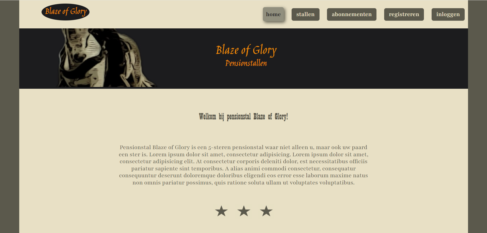

# Paardenstalapplicatie "Blaze of Glory" - Eindopdracht Frontend - Novi Hogeschool

---

Voor dit project is een installatiehandleiding geschreven, die zo is opgezet dat ook gebruikers zonder 
development-ervaring het project kunnen opstarten. De handleiding is geschreven voor gebruikers van __Windows__ .

## Inhoudsopgave

---

1. [Inleiding](#1-inleiding)
2. [Benodigdheden](#2-benodigdheden)
3. [Installatie instructies](#3-installatie-instructies)
4. [Beschikbare accounts](#4-beschikbare-accounts)
5. [Beschikbare scripts](#5-beschikbare-scripts)

## 1. Inleiding

---

Deze paardenstalapplicatie is ontwikkeld als eindopdracht voor de Frontend Leerlijn van Novi Hogeschool. Het betreft 
een webapplicatie met informatie over een pensionstal voor paarden en een klant- en beheerdersomgeving. Hier kunnen 
klanten online een abonnement op een stal aanvragen of annuleren en hun gegevens inkijken en wijzigen. De staleigenaar 
kan abonnementsaanvragen- en annuleringsverzoeken inwilligen.

Voor deze applicatie is in Java, voor een eerder gevolgde Backend Leerlijn, een eigen backend ontwikkeld (zie deze 
[link](https://github.com/Pincodeert/eindopdracht-backend-novi-paardenstal). Om de frontend te kunnen gebruiken is het 
noodzakelijk de bijbehorende backend te gebruiken. 

### Rollen

---
Voor het beveiligde gedeelte van de webapplicatie zijn 2 rollen ontwikkeld:
1. klant (user)
2. staleigenaar (admin)

Een deel van de webapplicatie is voor iedereen toegankelijk.

### Functionaliteiten

---
Afhankelijk van de rol van de gebruiker zijn de volgende functionaliteiten beschikbaar:

### user

* een aanvraag voor een bepaald abonnementstype doen
* persoonsgegevens invoeren
* paardgegevens invoeren
* paardenpaspoort uploaden
* persoons- paard- en abonnementgegevens bekijken
* persoonsgegevens wijzigen
* paardgegevens wijzigen
* een verzoek tot annulering van een abonnement doen
* inloggen en uitloggen

### admin

* een abonnementaanvraag activeren
* een paard toewijzen aan een stal
* een abonnement annuleren
* een paard verwijderen uit een stal
* klant- en paardgegevens bekijken
* inschrijvingen op een abonnementstype bekijken
* stallen en abonnementstypen bekijken
* inzage in het aantal openstaande taken
* inloggen en uitloggen

### iedereen
* algemene informatie over de pensionstal en beschikbaarheid abonnementstypen bekijken
* registreren als user/een user-account aanmaken.

## 2. Benodigdheden

---

Om de software op een lokale computer te kunnen gebruiken is het nodig om onderstaande programma's/onderdelen te
installeren op een lokale computer. Sommige zijn al standaard aanwezig of worden standaard met een ander programma 
geïnstalleerd. Omdat deze applicatie gebruik maakt van een in een eerdere backend-leerlijn zelf-ontwikkelde lokale 
backend in plaats van bv. een publieke API, is het belangrijk om ook alle benodigdheden voor de backend te installeren. 
Gemakshalve worden zo ook hier genoemd.

### Voor de frontend

* __Webstorm__

  Deze applicatie is ontwikkeld in de IDE (Integrated Development Enviroment) Webstorm. Om de code te kunnen draaien, 
  moet Webstorm op de lokale computer/laptop geïnstalleerd zijn. Webstorm is een betaalde IDE, maar er bestaat ook een 
  30-dagen gratis trial. Tijdens het ontwikkelen van deze applicatie is gebruikt gemaakt van de tool __Vite__ om het 
  snel en eenvoudig te kunnen genereren en snel op te kunnen starten. Het wordt automatisch meegeleverd in de meest 
  recente versies van Webstorm.  

* __Node.js__

  Node.js wordt onder andere gebruikt als runtime enviroment. Hierdoor kan javaScript code ook buiten de browser draaien
  op een lokale computer/laptop. Het tevens een omgeving voor handige developmenttools zoals bv een linter (bv ESLint) 
  en ook een open-source bibliotheek waarin bv voorgeprogrammeerde stukjes Javascriptcode (packages) kunnen worden 
  gedeeld en gebruikt. Daarnaast kan het als backend taal worden gebruikt (niet in dit project). Hoeft slechts éen maal 
  geinstallerd te worden. 

* __NPM__

  NPM (Node Packaage Manager) is een pakketbeheerder voor Node.js. Het is een tool die gebruikt wordt om packages (kant-
  en klare stukjes JavaScript software) te installeren, beheren en die gebruikt kunnen worden in Node.js-projecten. NPM 
  wordt automatisch meegeïnstalleerd bij Node.js.

* __Webbrowser__

  Voor de hand liggend is een webbrowser nodig om de webapplicatie te kunnen gebruiken. Tijdens het ontwikkelen is 
  gebruik gemaakt van Google Chrome. Voor het beste (visuele) resultaat wordt aangeraden deze webbrowser te gebruiken 
  maar er zijn diverse alternatieven.

* __Localhost__

  De applicatie is (vooralsnog) nog niet gedeployed en draait nog niet op een server. De applicatie wordt gedraaid op uw
  eigen pc of laptop. De frontend maakt hierbij gebruik van poort 5173

* __Backend/API__

  Om gebruik te kunnen maken van de interactieve functionaliteiten is het nodig om een backend te gebruiken. De 
  paardenstalapplicatie maakt gebruik van een voor de Backend-leerlijn eerder ontwikkelde backendsysteem. Het betreft 
  een restfull webservice met REST-enpoints en registreer- en inlog-functionaliteit. Zie hier:
  [link](https://github.com/Pincodeert/eindopdracht-backend-novi-paardenstal). Om de backend te kunnen gebruiken, 
  dient ook eerst een aantal installaties van programma's plaats te vinden. Deze worden hieronder beschreven. Er is geen
  API-key nodig. Wel is het belangrijk dat de backend wordt geïnstalleerd en draait op dezelfde pc of laptop als de 
  frontend, omdat beiden niet op een externe server draaien en anders niet met elkaar kunnen communiceren. De backend 
  draait op poort 8080 van uw eigen localhost.

### Voor de backend

* __IntelliJ IDEA__
  
  Dit is een IDE voor de backend waarin de code ontwikkeld is. Deze applicatie is gemaakt in de gratis
  te downloaden Community Edition van IntelliJ.

* __JDK__
  
  JDK staat voor Java Development Kit. Java is de programmeertaal waarin de bijbehorende backend ontwikkeld is. Om Java 
  op een pc of laptop te kunnen uitvoeren is het noodzakelijk om een Java Development Kit te downloaden. De backend maakt 
  gebruik van versie JDK-17. Deze is gratis te downloaden en gebruiken en kent een long-term support.

* __Localhost__
  
  Ook de backend is niet gehost op een externe server en draait alleen op localhost op de eigen lokale computer. De 
  backend maakt hiervoor gebruik van poort 8080.

* __PostgreSQL__
 
  Dit is een relationele database die nodig is om data te kunnen opslaan en ophalen en koppelingen tussen de data op te 
  slaan. PostgreSQL kan ook gratis gedownload worden. Tijdens de installatie wordt eveneens de tool pgAdmin 
  meegeïnstaleerd.  

* __pgAdmin__
  
  Dit is een grafische gebruikersinterface voor de database. Deze tool wordt tijdens de installatie van PostgreSQL 
  meegeïnstalleerd.
  

## 3. Installatie instructies

---

Omdat deze applicatie gebruik maakt van een eerder zelf ontwikkelde backend is het noodzakelijk om ook de installatie 
instructies voor de backend uit te voeren, zodat de applicatie volledig gebruikt kan worden. Gemakshalve zijn deze in de 
frontend installatiehandleiding meegenomen. Volg eerst alle installatie instructies voor de frontend, daarna voor 
de backend en voer vervolgens de stappen uit om de beide systemen te kunnen draaien:

### Voor de Frontend

1. Download en installeer Webstorm via deze 
   [link](https://www.jetbrains.com/webstorm/promo/?source=google&medium=cpc&campaign=EMEA_en_NL_WebStorm_Branded&term=webstorm&content=523833970967&gad_source=1&gclid=EAIaIQobChMIqf--59yohwMVlq-DBx2KfwDeEAAYASAAEgIIsPD_BwE). 
   Wanneer de installatie gelukt is, open Webstorm. 

2. Als het nog niet eerder gebeurd is, download en installeer Node.js via deze [link](https://nodejs.org/en/download/package-manager)
   Om te checken op Node.js al eerder geinstalleerd is of om te checken of de installatie gelukt is, type `node -v`in de
   terminal. Als hier nu een versienummer bv. `v20.11.1` verschijnt dan is de installatie (eerder) succesvol geweest. 
   Bij een andere melding bv `node: command not found` nog niet. Probeer de installatie dan opnieuw.

3. Check of NPM automatisch is meegeinstaleerd door in de terminal `npm -v` te typen. Indien dit gelukt is, verschijnt 
   wederom het versienummer bv. `9.6.5` in de terminal. Wanneer echter de melding `npm: command not found` verschijnt, 
   probeer Node.js dan opnieuw te installeren.

4. Zorg dat een browser beschikbaar is, bij voorkeur Google Chrome. Dat kan bv. hier: 
   [link](https://www.google.com/chrome/?brand=CHBD&ds_kid=43700052285348550&gad_source=1&gclid=EAIaIQobChMI1puxyeyohwMVcqiDBx0UHyFuEAAYASAAEgIyKPD_BwE&gclsrc=aw.ds)

5. Haal de brondcode voor de frontend binnen in Webstorm. Indien de broncode niet beschikbaar is gesteld kan via deze
   [link](https://github.com/Pincodeert/eindopdracht-frontend-novi-paardenstal) een ZIP-bestand gedownload worden door op de groene button `code` te clicken en vervolgens op 
   `Download ZIP`. Pak vervolgens het (meegeleverde) ZIP-bestand uit en sla het op in een map WebstormProjects. Open 
   Webstorm en click op `Open`. Selecteer vervolgens het bestand `eindopdracht-frontend-novi-paardenstal` en open het 
   project. De paardenstalapplicatie wordt nu in Webstorm geopend.   

6. Haal alle dependencies voor dit project binnen door onderaan in de terminal van Webstorm het commando `npm install` 
   te typen en op enter te clicken. Het duurt even voordat alle depencies zijn binnen gehaald.

7. Ga verder door de stappen voor de backend te volgen

### Voor de backend

8. Download en installeer IntelliJ via deze [link](https://www.jetbrains.com/idea/download/?section=windows). Kies voor 
   de Community Edition. Kies bij `Create Associations` voor `.java` en `.pom`. Wanneer de installatie voltooid is, open
   IntelliJ.

9. Installeer de Java Development Kit. De paardenstalapplicatie maakt gebruik van versie JDK-17. Click in IntelliJ op
   `New Project` en kies in het dropdown-menu van de JDK voor `+Add SDK`. Kies in het menu dat zich nu opent voor 
   `Download JDK` en vervolgens voor de openjdk versie 17 Amazon Coretto en click op `download` en vervolgens op `OK`.

10. Download en installeer PostgreSQL via deze [link](https://www.postgresql.org/download/). Kies de meest recente 
    versie voor Windows. Open het gedownloade bestand en volg de stappen van de setup wizard. Selecteer de gewenste 
    componenten om te selecteren. Selecteer in ieder geval de opties `PostgreSQL Server` en `pgAdmin4`. Vul 
    de poort in waar de server naar moet luisteren. Deze staat standaard op port `5432`. Als laatste moet er nog een 
    password worden gekozen om toegang te krijgen tot de database. __Let op!:__ dit password is straks in stap 12 ook 
    nodig om in de application.properties in IntelliJ te worden aangepast.

11. Zet de database klaar, zodat straks PostgreSQL gebruikt kan worden in het project in IntelliJ. Open hiervoor de 
    hierboven gesinstalleerde pgAdmin. Vul in het scherm dat nu openklapt het eerder opgegeven password in. Click 
    in het linker menu op `>Databases`, kies `Create` en vervolgens rechts hiervan `Database...`. Vervolgens opent zich 
    een scherm waarin de nieuwe database aangemaakt gaat worden. De `Owner` staat al ingesteld op `postgres`. Dit is ook
    de username die straks in stap 12 in de application.properties in IntelliJ geconfigureerd moet worden. Vul een naam 
    in bij `Database`, bv. paardenstal. Ook deze database naam moet straks worden aangepast in het project in IntelliJ. 
    Click vervolgens op `Save`.    

12. Voeg de brondcode van de backend toe in IntelliJ. Indien de broncode niet beschikbaar is gesteld kan via deze 
    [link](https://github.com/Pincodeert/eindopdracht-backend-novi-paardenstal) een ZIP-bestand gedownload worden door 
    op de groene button `code` te clicken en vervolgens op `Download ZIP`. Pak vervolgens het (meegeleverde) ZIP-bestand
    uit en sla het op in een map IdeaProjects. Open Intellij en click op `Open`. Selecteer vervolgens het bestand 
    `eindopdracht-backend-novi-paardenstal` en binnen deze map weer `pom.xml` en click vervolgens op `OK` en open het 
    project. De paardenstalapplicatie opent zich nu on IntelliJ. Selecteer nu in de linker menu-balk de projectmap `src`
    en ga binnen de `main`-map naar de map `resources` en click vervolgens op `application.properties`. En maak de 
    volgende aanpassingen in dit bestand (zie stap 10 en 11). Let op! GEEN spaties achter = teken.
    `spring.datasource.url=jdbc:postgresql://localhost:5432/plaats-hier-de-naam-van-de-database`
    `spring.datasource.username=plaats-hier-de-naam-van-de-owner`
    `spring.datasource.password=plaats-hier-het-gekozen-password`

### Om de applicatie te draaien

13. Run de backend code door in IntelliJ in de menubalk boven op de `groene pijl` te clicken of gebruik `Shift+F10`. De 
    backend is succesvol opgestart wanneer een dergelijke melding verschijnt: 
    `Started PaardenstalApplication in 4.449 seconds (JVM running for 4.815)`

14. Run de frontend code door in Webstorm het commando `npm run dev` in de terminal te typen gevolgd door enter. Wanneer dit gelukt 
    is, verschijnt de volgende link in de terminal `http://localhost:5173/`. Door hierop te clicken wordt de frontend 
    in webbrowser opgebouwd en kan de applicatie gebruikt worden. Veel plezier!

## 4. Beschikbare Accounts

---
Om de werking van de applicatie te kunnen testen, zonder eerst allerlei klanten en paarden enz op te voeren, zijn de 
volgende fictieve test-accounts beschikbaar.

### Voor de admin
Eén account beschikbaar:
* gebruikersnaam: dirtyharry 
* wachtwoord: GoAhead!

### Voor de klanten
Het __wachtwoord__ is telkens __gelijk aan__ de __gebruikersnaam__. Voor de volgende gebruikersnamen is een account beschikbaar:
* jonbonjovi
* tinaturner
* axlrose1
* neilyoung
* mickjagger
* barryhay
* eddievedder
* rockybalboa

NB. De account van Mick Jagger heeft 4 paarden, waarbij tevens een annulatieverzoek.

## 5. Beschikbare scripts

---

De volgende scripts/commando's kunnen in het project gebruikt worden

### `npm run dev` 
Start de dev server. Zorgt ervoor dat het project gestart en gerund wordt. aliases: `vite dev`, `vite serve`
Open http://localhost:5137 om het project te zien in de browser.

### `npm run build`
Bouwt het project op voor productie. Zorgt ervoor dat een kant en klare bundel wordt klaargezet in de "dist"-directory, 
van waaruit de hostingprovider de gebundelde bestanden kan gebruiken.

### `npm run preview`
Laat een preview van het voor productie gebundelde project zien. Hiermee kan gecheckt worden of alles werkt in productie
zoals verwacht. Niet geschikt om te gebruiken als een productie server, omdat het hiervoor niet ontworpen is.

### `npm run lint`
Genereert een overzicht van alle door de JavaScript-linter (ESlint) gevonden schoonheids- en kleinere programmeerfoutjes 
Hiermee wordt het makkelijker om (schoonheids)fouten in de code te vinden en op te lossen. 

---

## React + Vite

Deze applicatie is gemaakt met behulp van React en Vite. Hieronder meer informatie:

---
This template provides a minimal setup to get React working in Vite with HMR and some ESLint rules.

Currently, two official plugins are available:

- [@vitejs/plugin-react](https://github.com/vitejs/vite-plugin-react/blob/main/packages/plugin-react/README.md) uses [Babel](https://babeljs.io/) for Fast Refresh
- [@